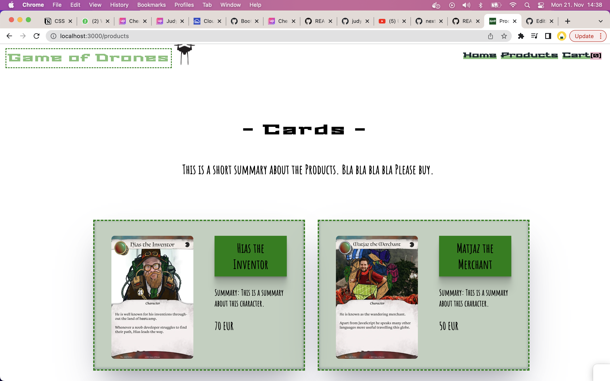
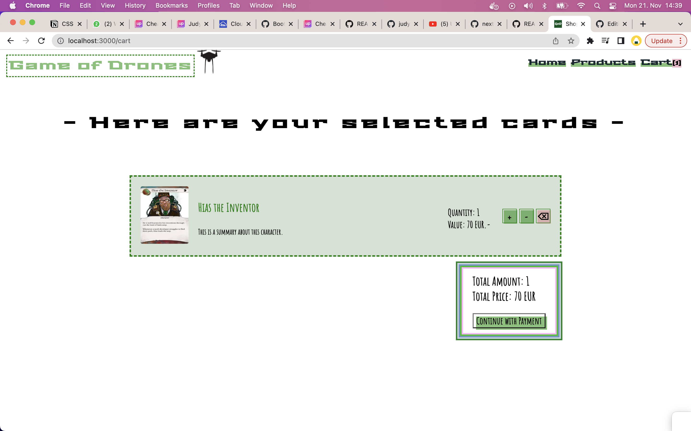

## ▶ Description

Welcome to game of drones. My fictional e-commerce store, that offers handmade trading cards!

## ▶ Functionalities

- `landing page`
- products page: with all cards displayed
- a single page for each card with details
  - toggle the counter and add cards to the cart with the button below
  - total quantity shown in the header
- `cart page`
  - displaying all cards in the cart with the correct quantity and price for each
  - total count of items and the total sum of the cart
  - adjust the quantities of items before proceeding to checkout
- `checkout page`
- `thank you page`

## ▶ Technologies

- Next.js
- React.js
- PostgreSQL
- Emotion
- Jest (Unit tests)
- Playwright (E2E tests)
- TypeScript
- GitHub Actions
- Lottie

## ▶ Setup instructions

- Clone the repository with `git clone <repo>`
- Setup the database by downloading and installing PostgreSQL
- Create a user and a database
- Create a new file `.env`
- Copy the environment variables from `.env-example` into `.env`
- Replace the placeholders xxxxx with your username, password and name of database
- Install dotenv-cli with `yarn add dotenv-cli`
- Run `yarn install` in your command line
- Run the migrations with `yarn migrate up`
- Start the server by running `yarn dev`

## ▶ Deploy on Fly.io
- Sign up on `Fly.io`
- On the `Fly.io Tokens page`, generate a new Fly.io access token named **GitHub Actions Deploy Token** and copy it from the text box that appears - **it will only be shown once**
- In your GitHub repo under `Settings → Secrets → Actions`, click the New repository secret button at the top right of the page and create a new token with the name FLY_API_TOKEN and the token you copied as the secret
- On the command line, log in to Fly.io using the following command and enter your credentials in the browser window that appears:
```
flyctl auth login
```
- Create an app, specifying the name using only lowercase letters and dashes:
```
flyctl apps create --name <app name>
```
- Create the Fly.io config files 
- Change your database/connect.ts
- Change your next.config.js 
- Add database credentials using `Fly.io secrets` (the credentials will be randomly generated for security):
```
flyctl secrets set PGHOST=localhost PGDATABASE=$(openssl rand -hex 16) PGUSERNAME=upleveled$(openssl rand -hex 16) PGPASSWORD=$(openssl rand -base64 32)
```
- If your app needs any additional environment variables such as API keys, also add them to the secrets using the following pattern:
```
flyctl secrets set <secret name>=<secret value>
```
- The Next.js documentation mentions exposing variables to the browser using variables prefixed with NEXT_PUBLIC_. Instead of using environment variables for this, we recommend declaring a JavaScript variable in your code because this information is not secret - it will be exposed to the browser. If you absolutely need to set a NEXT_PUBLIC_ environment variable, you can add it to your .env.production file.
- Create a 1GB volume for the PostgreSQL database in the Frankfurt region:
```
flyctl volumes create postgres --size 1 --region fra
```
- Deploy the first version of the app:
```
flyctl deploy
```




